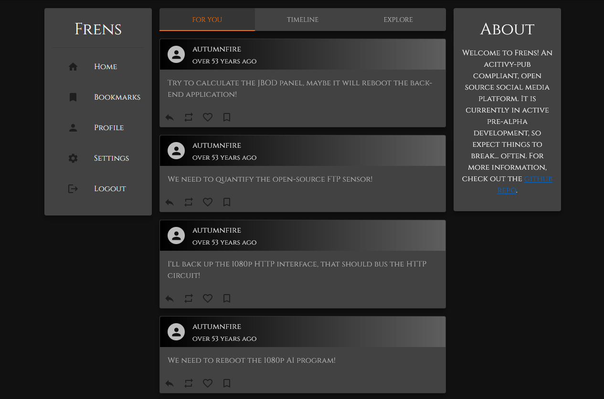
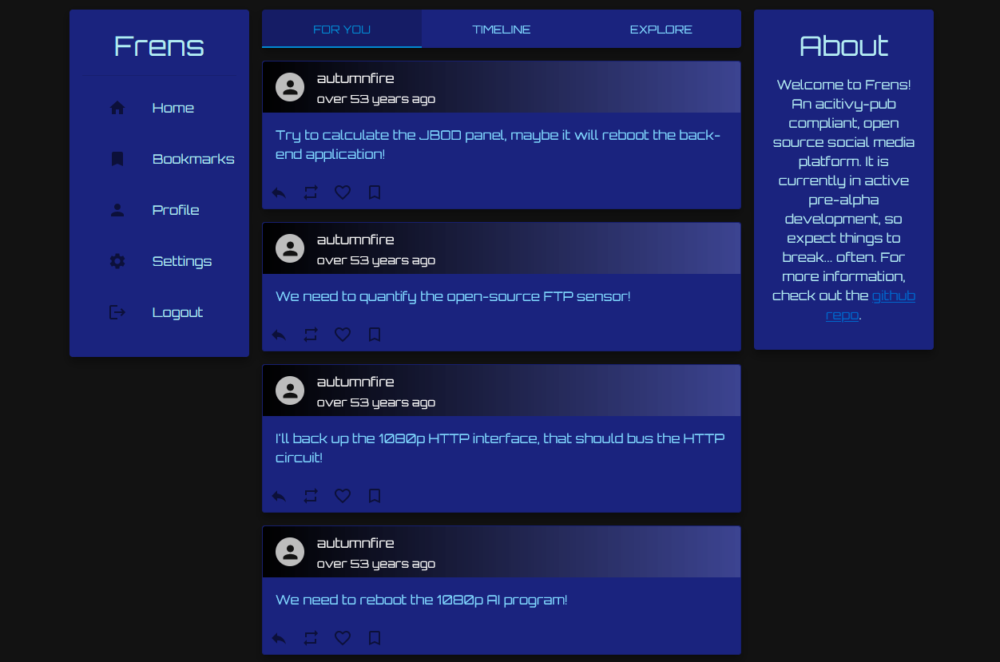
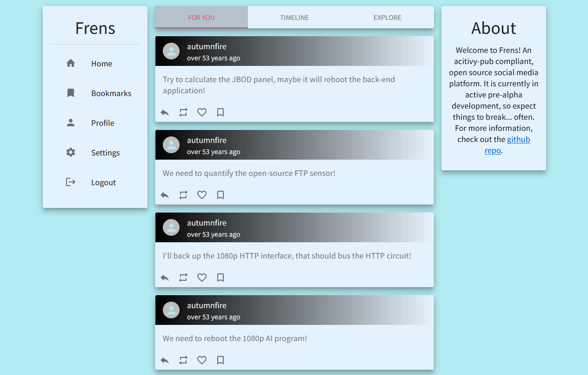

# Welcome to Frens

Welcome to Frens, a revolutionary decentralized social networking platform. Designed with a keen focus on performance, scalability, and an unwavering respect for user privacy, Frens delivers an elevated social media experience. Built with the power of Go, our platform stands as a lightweight, yet formidable solution, giving users unparalleled control over their data.

- To get started, please check out our [wiki](https://github.com/bwoff11/frens/wiki).

  
  
  

## 🛠 Built With

This project wouldn't be possible without these awesome technologies:

### Languages and Tools

- [Go](https://golang.org/): A statically typed, compiled language featuring type safety.
- [PostgreSQL](https://www.postgresql.org/): A free and open-source relational database system.

### Libraries

- [Go Fiber](https://github.com/gofiber/fiber): An Express.js inspired web framework built on top of the fastest HTTP engine for Go.
- [Gorm](https://gorm.io/): A fantastic developer-friendly database interface ORM library for Golang.
- [Viper](https://github.com/spf13/viper): A complete configuration solution for Go applications including 12-Factor apps.
- [Zap Logging](https://github.com/uber-go/zap): A blazing fast, structured, leveled logging in Go.

### Specifications

- [JSON API](https://jsonapi.org/): A specification for how a client should request that resources be fetched or modified.
- [OpenAPI](https://swagger.io/specification/): A specification for describing, producing, and consuming RESTful web services.

### Services

- [reCAPTCHA](https://www.google.com/recaptcha/about/): A Google service that distinguishes human users from bots.

# The Purpose

Frens was born out of a necessity to address prevalent issues in current ActivityPub implementations. Our mission is to redefine the standards and deliver an optimized user experience.

## User Experience and Interface

A server oriented towards end-users requires an intuitive and appealing frontend. With the ambition to establish more than just a standard, we're developing our own frontend, [Frens Frontend Material](https://github.com/bwoff11/frens-frontend-material). Our goal is to inspire others to create frontends, but only after we've established that it's feasible to develop an easy-to-use, aesthetically pleasing frontend. We've adopted the JSON API standard to provide developers with a consistent and reliable interface, protecting them from ever-evolving and inconsistent standards.

## Performance and Sustainability

We've observed existing implementations to be either performance-limited or too arcane for widespread contributions. Our choice of the Go programming language aims to resolve these issues. Go offers satisfactory performance and, more importantly, a codebase that is comprehensible and accessible for contributions. Furthermore, we've opted for a SQL database over a graph database. Despite the suitability of graph databases for social networks, their complexity and maintenance requirements outweigh their benefits. A SQL database, on the other hand, is easier to maintain and is more familiar to a wider audience.

## Embracing Modern Technologies

In our pursuit of delivering an exemplary user experience, we've chosen to incorporate a variety of contemporary technologies. These include features such as algorithmic feeds and subscription services. We believe that when deployed thoughtfully, these technologies can substantially enhance user engagement and interaction. While we are still evaluating the suite of features we will provide, we do not shy away from integrating technologies that mutually benefit users and server operators.

## Adherence to Professional Standards

Regrettably, certain project communities fail to meet the professional standards we believe to be essential. At Frens, we aim to be a beacon of professionalism, inclusivity, and excellence. We strive to foster a project that others can admire and learn from. To ensure this, we've drafted a Code of Conduct that respects the identities and affiliations of _all_ individuals. We are committed to implementing workflows and standards that inspire confidence in the reliability and security of our platform.

## License

Frens is released under the MIT License. We welcome contributions that align with our mission and uphold our standards.
